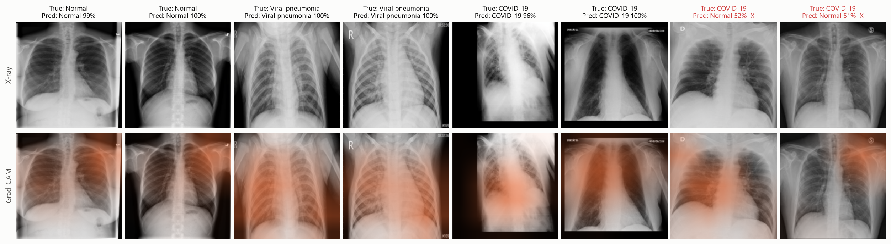
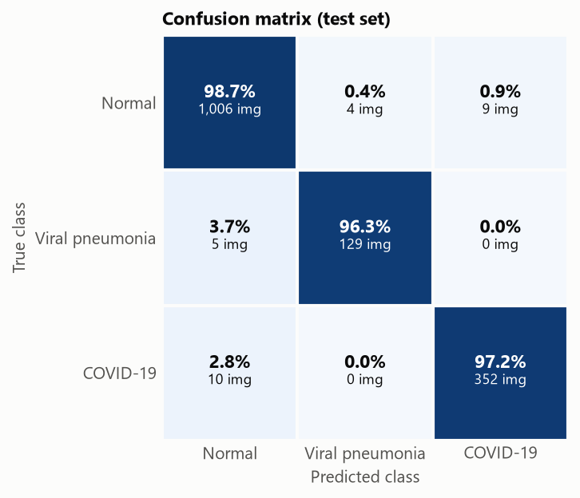
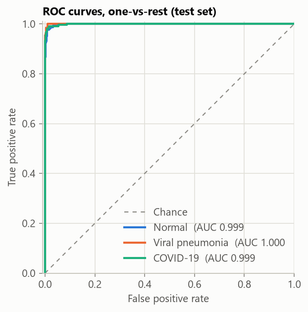
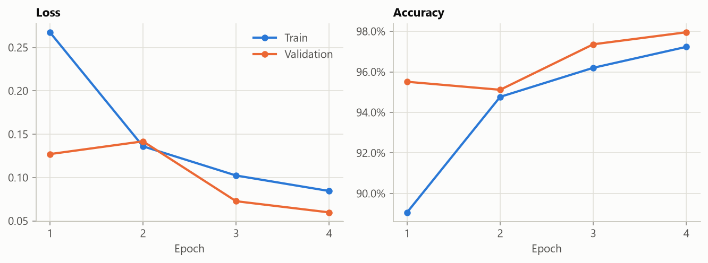

# COVID-19 Chest X-Ray Classifier

This project fine-tunes an ImageNet-pretrained **ResNet-18** in PyTorch to classify chest X-rays as **Normal**, **Viral Pneumonia** or **COVID-19**. It uses Grad-CAM to show which parts of each image the model relied on.
The base is from a [Coursera guided project](https://www.coursera.org/projects/covid-19-detection-x-ray) which I rebuilt into a full pipeline with proper evaluation. See [What I added](#what-i-added) for details.


<sub>Test-set examples. Top row: the input X-ray. Bottom row: the Grad-CAM heatmap where stronger orange means the region had more influence on the prediction. The two images on the right, marked X in red, were misclassified.</sub>

## What I added

The guided project trains a ResNet-18 and shows predictions on a few sample images. This project extends it with:

| | Course | This project |
|---|---|---|
| Evaluation | Accuracy on a few sample batches | A held-out test set scored once, with per-class precision, recall, F1, ROC AUC and a confusion matrix |
| Data split | Train/test only | Train/validation/test (8:1:1, stratified) with the epoch chosen on validation |
| Class imbalance | Not handled | Class-balanced sampling; balanced accuracy used for model selection |
| Augmentation | Horizontal flip | Small rotations, shifts, zooms and contrast jitter with no horizontal flip because chest anatomy is not symmetric |
| Explainability | None | Grad-CAM written with PyTorch hooks and used to check the model's mistakes |
| Code | A single notebook | A Python package with command-line scripts, plus a notebook to walk through results |

## Results

Results are on a held-out test set of **1,515 images**. These images were not used for training or for selecting the model, and each one is scored exactly once.

| Accuracy | Balanced accuracy | Macro F1 |
|:---:|:---:|:---:|
| **98.2%** | **97.4%** | **0.975** |

| Class | Precision | Recall | F1 | ROC AUC | Test images |
|---|---:|---:|---:|---:|---:|
| Normal | 0.985 | 0.987 | 0.986 | 0.999 | 1,019 |
| Viral pneumonia | 0.970 | 0.963 | 0.966 | 1.000 | 134 |
| COVID-19 | 0.975 | 0.972 | 0.974 | 0.999 | 362 |

<p>
  
  
</p>

28 of the 1,515 images are misclassified. Most errors are confusions between Normal and COVID-19 (19 images). Normal is wrongly predicted as Viral pneumonia 4 times, and Viral pneumonia is incorrectly classified as Normal 5 times. Viral pneumonia is not confused with COVID-19 in either direction.

The test set is imbalanced with two thirds of it being Normal. Thus, **balanced accuracy** (the mean recall across the three classes) is used for model selection instead of general accuracy.

See [Limitations](#limitations). The high scores are probably helped by differences between the image sources used for each class.

## How it works

### Data
The data is the [COVID-19 Radiography Database](https://www.kaggle.com/datasets/tawsifurrahman/covid19-radiography-database), version 5, from Kaggle. It is downloaded automatically with `kagglehub`. The *Lung Opacity* class is not used.

Each class is split 8:1:1 into train, val and test, with seed 42:

| Split | Normal | Viral pneumonia | COVID-19 | Total | Used for |
|---|---:|---:|---:|---:|---|
| Train | 8,154 | 1,077 | 2,892 | 12,123 | Fitting the weights |
| Validation | 1,019 | 134 | 362 | 1,515 | Choosing the best epoch |
| Test | 1,019 | 134 | 362 | 1,515 | The final numbers above, evaluated once |

The split is written to `data/splits.csv` as a list of paths into the kagglehub cache so images are not copied.

### Model and training
- **Model:** a `torchvision` ResNet-18 with ImageNet weights. The final layer is replaced with a 3-class `Linear(512, 3)` layer. The whole network is fine-tuned.
- **Class balancing:** Normal has 8 times as many training images as Viral pneumonia. A `WeightedRandomSampler` weights each image by 1/(size of its class) so each class makes up around a third of every epoch. An epoch is 3,000 sampled images.
- **Augmentation:**
  - Small random rotations (±10°), shifts (5%) and zooms (±5%).
  - Brightness and contrast jitter (±20%).
  - No horizontal flip: a chest X-ray has fixed left–right anatomy (the heart is on the left), so a mirrored image is unrealistic.
- **Optimisation:** AdamW (learning rate 1e-4, weight decay 1e-4), a cosine learning-rate schedule, batch size 32 and cross-entropy loss.
- **Model selection:** after each epoch the model is scored on the validation set. The checkpoint with the best validation balanced accuracy is kept.

| Epoch | Train loss | Val loss | Val accuracy | Val balanced accuracy |
|---:|---:|---:|---:|---:|
| 1 | 0.268 | 0.127 | 95.5% | 95.7% |
| 2 | 0.136 | 0.142 | 95.1% | 92.9% |
| 3 | 0.102 | 0.073 | 97.4% | 97.0% |
| **4** | **0.084** | **0.060** | **98.0%** | **97.6%** |


<sub>Loss and accuracy per epoch. Validation loss keeps falling through epoch 4 so the model is not overfitting yet and could possibly train for longer.</sub>

### Grad-CAM
[Grad-CAM](https://doi.org/10.1007/s11263-019-01228-7) (Selvaraju et al., 2020) shows which regions of an image pushed the model towards its prediction:
1. Take the gradient of the predicted class score with respect to the feature maps of ResNet's last convolutional block.
2. Average each map's gradient to get a weight for that map.
3. Add up the maps using those weights, keep only the positive values, and resize the result to the image size.

The implementation in [`covid_classifier/gradcam.py`](covid_classifier/gradcam.py) uses PyTorch hooks and no extra libraries.

Grad-CAM helps check whether the model is relying on the right parts of an image. For example, heatmaps over the lung fields are a good sign. Heat over the borders, the text markers burned into the image or medical devices suggests the model has learned a shortcut instead of the disease.

## How to run

```bash
git clone https://github.com/ManahilMuhammad/covid-classifier.git
cd covid-classifier

conda create -n covid-classifier python=3.12
conda activate covid-classifier
pip install -r requirements.txt
```

Run the pipeline from the command line:

```bash
python -m covid_classifier.data       # download the dataset and write the split
python -m covid_classifier.train      # finetune and save checkpoints
python -m covid_classifier.evaluate   # test metrics, confusion matrix and ROC curves
python -m covid_classifier.gradcam    # Grad-CAM figure
```

Each script takes `--help`. For example, `python -m covid_classifier.train --epochs 6 --lr 3e-4`. A CUDA GPU is used automatically if one is available.

Open [`classifier.ipynb`](classifier.ipynb). It loads the trained checkpoint, so run the scripts above first.

## Project structure

```
covid-classifier/
├── covid_classifier/
│   ├── config.py      # class names, paths, image constants
│   ├── data.py        # download, train/val/test split, transforms, class-balanced loaders
│   ├── model.py       # ResNet-18 builder, checkpoint save/load
│   ├── train.py       # training loop and validation-based model selection
│   ├── evaluate.py    # metrics, confusion matrix, ROC curves
│   ├── gradcam.py     # Grad-CAM implementation and figure
│   └── plotting.py    # shared matplotlib style
├── classifier.ipynb   # notebook tour of the results
└── assets/            # figures used in this README
```

The following folders are created when you run the scripts but are not tracked by git: `data/` (the split file), `checkpoints/` (model weights) and `results/` (metrics, predictions and training history).

## Limitations

- **The test set comes from the same sources as the training data.** A 98% score here says little about how the model would do on X-rays from another hospital. An external test set would be needed.
- **The viral pneumonia class is small.** It has 134 test images so its precision and recall are less certain than that of other classes.
- **Only one training run was made** so it is unknown how much the numbers would vary with a different random seed.

## Disclaimer

This is an educational project. **It is not a medical device and must not be used for diagnosis.**

## Acknowledgements

**Dataset**: Tawsifur Rahman, Dr. Muhammad Chowdhary and Amith Khandakar, June 2020. COVID-19 Radiography Database, Version 5. https://www.kaggle.com/datasets/tawsifurrahman/covid19-radiography-database 

**Grad-CAM**: Selvaraju, R. R., Cogswell, M., Das, A., Vedantam, R., Parikh, D., & Batra, D. (2020). Grad-CAM: Visual explanations from deep networks via gradient-based localization. International Journal of Computer Vision, 128(2), 336-359. https://doi.org/10.1007/s11263-019-01228-7

**Course**: Amit Yadav. *Detecting COVID-19 with Chest X Ray using PyTorch*. Coursera Project Network, Coursera. https://www.coursera.org/projects/covid-19-detection-x-ray 
